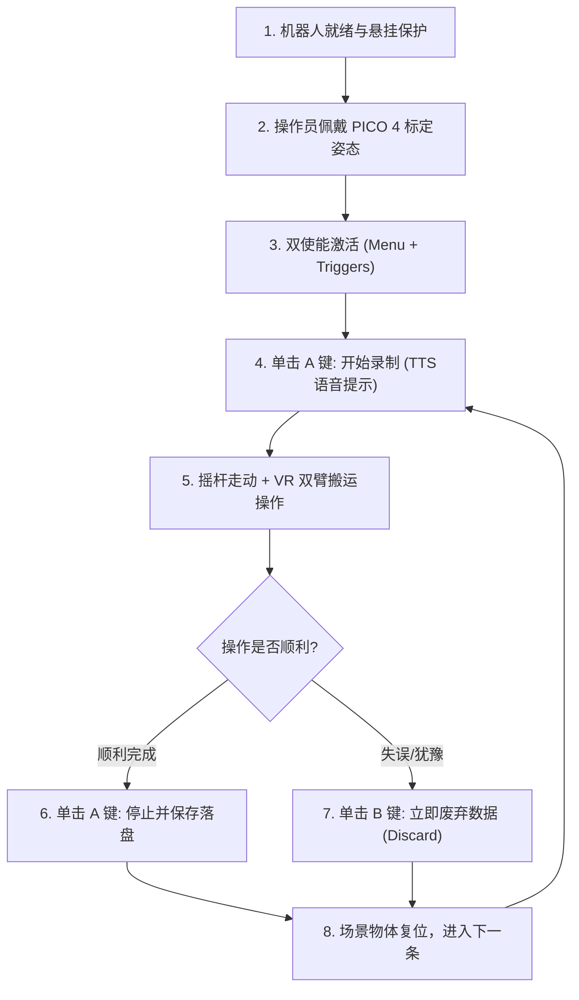

# Unitree G1 移动操作（Loco-Manipulation）数据采集、遥操与格式转换全指南

本文档全面系统地介绍了 Unitree G1 人形机器人在移动操作（Loco-manipulation）任务下的两套完整数据采集与控制方案，以及面向 LeRobot v3.0 / $\pi_0$ 策略模型的格式转换与训练全流程：

* **第一部分：基于人体动捕差分的全身平滑采集方案（类 Psi0 / SONIC 免摇杆方案）**  
  依靠操作员身体真实空间位移差分自动生成连续平滑的速度指令，天然消除底盘冲击与动作抖动，适用于短程（1~2米内）精细搬运与视觉微调作业。
* **第二部分：基于 GR00T Decoupled WBC 的摇杆 + VR 上肢解耦采集方案（PICO 4 VR 方案）**  
  基于 NVIDIA GR00T 解耦全身控制器，双手柄 6D 空间追踪遥操双臂（14-DoF），双摇杆独立操控底盘全向移动（15-DoF 步态），彻底突破动捕场地范围限制，适用于长距离移动、大范围巡航抓取与复杂移动操作。
* **第三部分：统一数据格式、底层映射机制与模型微调部署**  
  阐述底层 29-D 状态与 18-D 动作向量的定义、摇杆与速度指令在底层控制器的缩放映射规则，以及直接微调现有 VLA 模型（如 `model/unitree_box_move`）的训练与部署闭环。

---

## 目录
* [第一部分：基于人体动捕差分的全身平滑采集方案（免摇杆方案）](#第一部分基于人体动捕差分的全身平滑采集方案免摇杆方案)
  * [1. 设计理念与方案优势](#1-设计理念与方案优势)
  * [2. 硬件拓扑与系统架构](#2-硬件拓扑与系统架构)
  * [3. 速度指令自动提取机制（为什么不用摇杆）](#3-速度指令自动提取机制为什么不用摇杆)
  * [4. 任务范式与短程微调流程](#4-任务范式与短程微调流程)
  * [5. 动捕差分方案标准作业程序（SOP）](#5-动捕差分方案标准作业程序sop)
* [第二部分：基于 GR00T Decoupled WBC 的摇杆 + VR 上肢解耦数据采集方案](#第二部分基于-gr00t-decoupled-wbc-的摇杆--vr-上肢解耦数据采集方案)
  * [6. 解耦控制理念与底层架构](#6-解耦控制理念与底层架构)
  * [7. Docker 运行环境与依赖配置（避坑指南）](#7-docker-运行环境与依赖配置避坑指南)
  * [8. PICO 4 VR 控制器映射与功能定义](#8-pico-4-vr-控制器映射与功能定义)
  * [9. GR00T Decoupled WBC 数据采集标准作业程序（SOP）](#9-gr00t-decoupled-wbc-数据采集标准作业程序sop)
  * [10. 采集数据落盘格式与结构](#10-采集数据落盘格式与结构)
  * [11. 两套方案深度对比与选型决策指南](#11-两套方案深度对比与选型决策指南)
* [第三部分：统一数据格式、底层映射机制与模型微调部署](#第三部分统一数据格式底层映射机制与模型微调部署)
  * [12. 统一 LeRobot v3.0 数据结构与字段定义](#12-统一-lerobot-v30-数据结构与字段定义)
  * [13. 遥控速度指令的底层映射机制与真实数据分布](#13-遥控速度指令的底层映射机制与真实数据分布)
  * [14. 原始动捕/遥操数据到 LeRobot v3.0 的转换映射](#14-原始动捕遥操数据到-lerobot-v30-的转换映射)
  * [15. 微调模型推荐数据量与训练部署指南](#15-微调模型推荐数据量与训练部署指南)

---

# 第一部分：基于人体动捕差分的全身平滑采集方案（免摇杆方案）

## 1. 设计理念与方案优势

在人形机器人双臂搬运与移动操作任务中，传统的“**手柄摇杆控制底盘 + 外骨骼/遥操控制双臂**”方式存在显著弊端：

| 对比维度 | 传统手推摇杆方式 | 本方案（类 Psi0 身体动捕差分） |
| :--- | :--- | :--- |
| **速度连贯性** | 存在死区与阶跃突变（Bang-bang 开关效应），速度断断续续 | **天然具备人体物理惯性与加速度，属于 $C^2$ 连续平滑曲线** |
| **下肢平衡冲击** | 阶跃速度给 50Hz 底层平衡控制器带来巨大冲击，易失稳晃动 | **速度渐进升降，下肢步态极其平稳自然，彻底杜绝下肢晃动** |
| **操作协调度** | 操作员需要一手管手臂一手推摇杆，分心且动作极易割裂 | **操作员自然向前迈步、转身，全身协同直观，沉浸感极强** |
| **模型模仿学习质量** | 模型学习到剧烈抖动的速度指令，推理时机械臂与底盘容易抽动 | **训练出的 VLA 策略动作舒展连贯，实机部署成功率大幅提升** |

---

## 2. 硬件拓扑与系统架构

```text
┌──────────────────────────────────────────────────────────────────────────────┐
│                            上位机 (GPU Workstation)                          │
│                           IP: 192.168.123.213                                │
│                                                                              │
│  【VR 空间动捕追踪】                                                        │
│   ├─ 头显 + 手柄 6D 位姿追踪 (50Hz)                                          │
│   ├─ 身体空间位移时间差分 ──► 生成连续平滑 [vx, vy, vyaw] 与 height            │
│   └─ 双臂空间位姿逆运动学 ──► 解算双臂 14 关节目标角度                       │
│                                                                              │
│  【数据落盘 / Exporter】                                                     │
│   ├─ 自动打包并保存为标准 Episode (不含失败轨迹)                             │
│   └─ 格式转换器 ──► 生成 LeRobot v3.0 (29-D State + 18-D Action)             │
└───────────────────────┬──────────────────────────────────────────────────────┘
                        │ 千兆以太网直连 (网卡: enx6c1ff724495a)
┌───────────────────────▼──────────────────────────────────────────────────────┐
│                         Unitree G1 机器人本体                                │
│                           IP: 192.168.123.164                                │
│                                                                              │
│  【机载服务】                                                                │
│   ├─ ZMQ 5555: RealSense 头部机载摄像头实时推流 (480x640x3 RGB)              │
│   ├─ ZMQ 6000/6001: 底层电机 DDS 桥接                                        │
│   └─ 50Hz 全身平衡控制器 (SONIC / GR00T WBC)                                 │
│       ├─ 接收平滑速度指令 ──► 解算下肢与腰部 15 关节步态驱动迈步             │
│       └─ 接收双臂目标角度 ──► 驱动双臂 14 关节执行合抱搬运                   │
└──────────────────────────────────────────────────────────────────────────────┘
```

---

## 3. 速度指令自动提取机制（为什么不用摇杆）

当操作员佩戴 VR 设备在空间中移动时，系统每 $20\text{ ms}$（$50\text{ Hz}$）记录一次操作员躯干/骨盆位姿 $P(t) = [x(t), y(t), z(t)]$ 与旋转四元数 $Q(t)$：

1. **前后与横向线速度计算**：
   $$v_x(t) = \frac{x(t) - x(t-\Delta t)}{\Delta t}, \quad v_y(t) = \frac{y(t) - y(t-\Delta t)}{\Delta t}$$
2. **转向角速度计算**：
   $$\omega_z(t) = \frac{\text{yaw}(t) - \text{yaw}(t-\Delta t)}{\Delta t}$$
3. **骨盆高度计算**：
   $$h(t) = z(t)$$

这一组由身体真实位移微分得到的速度与高度数据：
* **在实时遥控时**：直接送入 SONIC WBC / Planner，带动 G1 机器人双足踏步前移或原地转体。
* **在数据落盘时**：作为真实的连续动作标签写入数据集，完全避免了摇杆死区和跳变。

---

## 4. 任务范式与短程微调流程

由于 G1 机载 RealSense 头部摄像头视场角（FOV 约 70°~80°）有限，**为了保证策略的视觉连续性，任务应当设计为“初始在视野内 $\rightarrow$ 短程微调步态 $\rightarrow$ 抓取搬运”**。

```text
[阶段 1: 站立就绪] (0~3s)   ──► 机器人距桌台 0.6~1.0m，箱子位于头部视野中央
          │
[阶段 2: 逼近微调] (3~6s)   ──► 自然前移 1~2 步 (系统记录 vx ≈ 0.15~0.25 m/s 平滑速度)，贴近桌沿停步
          │
[阶段 3: 双手合抱] (6~12s)  ──► 速度自然归 0，双手下压抱紧箱子并起吊至胸前
          │
[阶段 4: 原地转身] (12~18s) ──► 身体原地旋转踏步 1~2 步 (系统记录 ωz ≈ 0.3 rad/s 旋转速度)，对准目标放置台
          │
[阶段 5: 放置复位] (18~25s) ──► 双臂展开将箱子放置在目标桌台，身体轻退半步，本条结束
```

---

## 5. 动捕差分方案标准作业程序（SOP）

### 5.1 安全与物理准备
1. **吊架悬挂**：必须使用龙门架/弹性挂绳吊住 G1 机器人的安全吊环，调节绳长使脚掌平稳着地且具有跌落保护。
2. **环境布置**：将起始桌台与目标桌台放置在机器人周围，保证箱子在机器人初始站立时的机载视野正中偏下区域。

### 5.2 启动机载服务
SSH 登录 G1 机器人（`ssh unitree@192.168.123.164`）：
```bash
cd ~/lerobot
./start_server.sh
```

### 5.3 启动采集流
在上位机启动 VR 动捕与数据录制服务（通过 `psi_rtc_sonic_client` 或 `run_data_exporter.py`）：
* 操作员佩戴好 VR 头显和手柄。
* 观察机载图像画面，确认相机连接正常（端口 5555）。

### 5.4 录制交互与质量规范
* **一条数据（1 Episode）**：必须是一次**完整、连贯、成功**的“走近 $\rightarrow$ 抱起 $\rightarrow$ 转身 $\rightarrow$ 放下”全过程（耗时约 25~35 秒）。
* **按键管理**：
  * 若操作失误（如没抱稳、掉落、动作犹豫），**立即废弃重录（按 `←` 或手柄重录快捷键）**。
  * 顺利完成后保存进入下一条（按 `→`），并在 10~15 秒复位时间内将箱子放回起始点。

---

# 第二部分：基于 GR00T Decoupled WBC 的摇杆 + VR 上肢解耦数据采集方案

## 6. 解耦控制理念与底层架构

在复杂场景、长距离巡航或受限于室内动捕场地范围时，**GR00T Decoupled Whole-Body Control（解耦全身控制）** 提供了一种高灵活性的采集架构。其核心理念是**上肢高精度操作与下肢全向底盘运动完全解耦**：

```text
┌─────────────────────────────────────────────────────────────────────────────┐
│                          PICO 4 VR 空间遥操终端                              │
│                                                                             │
│   【双手柄 6D 空间追踪】                           【双手柄摇杆与按键】       │
│   ├─ 左/右手腕位姿 [x,y,z,qx,qy,qz,qw]             ├─ 左摇杆: [vx, vy] 全向平移 │
│   └─ 扳机/抓握键: 灵巧手/夹爪闭合                   ├─ 右摇杆: [wz] 偏航转向    │
│                                                   ├─ Y/X 键: 底盘高度升降    │
│                                                   └─ A/B 键: 录制开始/废弃   │
└───────────────────────┬─────────────────────────────────┬───────────────────┘
                        │                                 │
┌───────────────────────▼─────────────────────────────────▼───────────────────┐
│                      GR00T Decoupled WBC 核心求解框架                        │
│                                                                             │
│   【上肢 IK 运动学解算器】                        【下肢全身强化学习步态】     │
│   • Pink / Pinocchio 优化求解器                   • 双策略 ONNX 神经网络:    │
│   • 约束: body_active_joint_groups=["upper_body"]    - Balance.onnx (静止平衡)│
│   • 目标: 仅求解双臂 14 关节弧度                      - Walk.onnx (动态双足行走)│
│   • 腰部/下肢完全不受上肢拖拽影响                  • 模长阈值 (0.05m/s) 自动切换 │
└───────────────────────┬─────────────────────────────────┬───────────────────┘
                        │                                 │
                        └───────────────┬─────────────────┘
                                        ▼
                        Unitree G1 29-DoF 机器人本体 / 仿真器
```

### 6.1 上肢解耦机制（14-DoF）
在 [`decoupled_wbc/control/main/teleop/run_teleop_policy_loop.py`](file:///home/yichangfeng/GR00T-WholeBodyControl/decoupled_wbc/control/main/teleop/run_teleop_policy_loop.py#L40-L46) 中，上肢求解器配置为：
```python
retargeting_ik = TeleopRetargetingIK(
    robot_model=robot_model,
    left_hand_ik_solver=left_hand_ik_solver,
    right_hand_ik_solver=right_hand_ik_solver,
    enable_visualization=config.enable_visualization,
    body_active_joint_groups=["upper_body"],  # 严格限制解算空间仅在上肢双臂
)
```
这确保了操作员即使双臂挥动幅度极大，也不会在运动学层面对下肢与腰部产生反向力矩干涉。

### 6.2 下肢解耦机制（15-DoF：12 腿部关节 + 3 腰部关节）
底盘由 PICO 手柄摇杆输入的全向线速度与角速度指令驱动。底层 WBC 载入预训练的 ONNX 神经网络策略：
* 当遥控速度模长 $\|[v_x, v_y, \omega_z]\| < 0.05\text{ m/s}$ 时，自动激活 **Balance Policy**，下肢与腰部自动微调各关节力矩维持绝对稳定站立。
* 当模长 $\ge 0.05\text{ m/s}$ 时，平滑切入 **Walk Policy**，自动规划足端摆动相与着地支撑相，实现高抗扰的动态双足迈步。

---

## 7. Docker 运行环境与依赖配置（避坑指南）

> [!CAUTION]
> **为什么不要在宿主机直接通过 pip 安装 `decoupled_wbc[full]`？**  
> `decoupled_wbc` 深度依赖 CycloneDDS、ROS 2 Humble、Pinocchio、Pink、ONNX Runtime、`unitree_sdk2py`、`composed_camera` 以及 `rerun-sdk`。在宿主机多版本 Python/Conda 混用时极易出现 C++ ABI 冲突与连锁性 `ModuleNotFoundError`。  
> **官方推荐且唯一稳定的运行方式是使用 Docker 容器。**

### 7.1 宿主机 Docker 与 NVIDIA Container Toolkit 安装
在宿主机终端执行：
```bash
# 1. 安装基础 Docker
sudo apt-get update
sudo apt-get install -y docker.io
sudo usermod -aG docker $USER

# 2. 配置 NVIDIA Container Toolkit (用于容器内调用 GPU)
curl -fsSL https://nvidia.github.io/libnvidia-container/gpgkey | sudo gpg --dearmor -o /usr/share/keyrings/nvidia-container-toolkit-keyring.gpg
curl -s -L https://nvidia.github.io/libnvidia-container/stable/deb/nvidia-container-toolkit.list | \
  sed 's#deb https://#deb [signed-by=/usr/share/keyrings/nvidia-container-toolkit-keyring.gpg] https://#g' | \
  sudo tee /etc/apt/sources.list.d/nvidia-container-toolkit.list

sudo apt-get update
sudo apt-get install -y nvidia-container-toolkit
sudo nvidia-ctk runtime configure --runtime=docker
sudo systemctl restart docker
```

### 7.2 启动官方 Docker 容器
进入 `GR00T-WholeBodyControl/decoupled_wbc` 目录，拉取镜像并启动：
```bash
cd /home/yichangfeng/GR00T-WholeBodyControl/decoupled_wbc

# 首次运行使用 --install 拉取远程官方预编译镜像 nvgear/gr00t_wbc:latest
./docker/run_docker.sh --install --root
```
容器启动后将自动映射 X11 显示、声卡、USB 与显卡设备，工作目录位于 `/home/<username>/Projects/decoupled_wbc`。

---

## 8. PICO 4 VR 控制器映射与功能定义

依据 [`decoupled_wbc/control/teleop/streamers/pico_streamer.py`](file:///home/yichangfeng/GR00T-WholeBodyControl/decoupled_wbc/control/teleop/streamers/pico_streamer.py#L108-L194)，PICO 4 VR 控制器的完整键位与功能映射如下：

```text
       左手柄 (Left Controller)                    右手柄 (Right Controller)
     ┌────────────────────────┐                  ┌────────────────────────┐
     │  [Y] [X] 升降底盘高度   │                  │  [B] 放弃/丢弃当前录制   │
     │  (O) 左摇杆: vx / vy   │                  │  [A] 开始/保存当前录制   │
     │  [Menu] 激活组合功能   │                  │  (O) 右摇杆: wz 原地转向 │
     │  [Trigger] 灵巧手/使能 │                  │  [Trigger] 灵巧手/使能 │
     │  [Grip] 侧握紧抓取     │                  │  [Grip] 侧握紧抓取     │
     └────────────────────────┘                  └────────────────────────┘
```

### 8.1 完整键位功能表

| 控制器部位 | 按键 / 摇杆 | 触发类型 | 功能说明与底层映射参数 |
| :--- | :--- | :---: | :--- |
| **左手柄** | **左摇杆 (Stick)** | 模拟量 | **底盘全向平移**：<br>• 前推/后拉：$v_x \in [-0.5, 0.5]\text{ m/s}$（带 0.1 死区）<br>• 左推/右推：$v_y \in [-0.5, 0.5]\text{ m/s}$（带 0.1 死区） |
| **右手柄** | **右摇杆 (Stick)** | 模拟量 | **底盘偏航转向**：<br>• 左推/右推：$\omega_z \in [-1.0, 1.0]\text{ rad/s}$（带 0.1 死区） |
| **左手柄** | **Y 键 / X 键** | 单击 | **底盘目标高度微调**：<br>• 按 `Y`：躯干升高 $+0.01\text{ m}$<br>• 按 `X`：躯干降低 $-0.01\text{ m}$（限幅范围 $[0.2, 0.74]\text{ m}$） |
| **左手柄 + 右手柄** | **左 Menu + 右 Trigger** | 组合按键 | **上肢遥操激活开关 (Toggle Teleop Activation)**：<br>双臂逆运动学（IK）控制器的启动与待机锁死 |
| **左手柄 + 左手柄** | **左 Menu + 左 Trigger** | 组合按键 | **下肢步态激活开关 (Toggle Policy Locomotion)**：<br>双足步态行走的解算开关（站立/行走策略激活） |
| **右手柄** | **A 键** | 单击 | **数据录制控制 (Toggle Data Collection)**：<br>单击进入 `Recording`（开始录制），再次单击进入 `NeedToSave` 并保存落盘 |
| **右手柄** | **B 键** | 单击 | **放弃并丢弃当前轨迹 (Abort / Discard)**：<br>若当前动作出现失误，按 `B` 键直接将当前轨迹标记为废弃，清空缓存重置为 `Idle` |
| **双手柄** | **Trigger / Grip** | 模拟量 | **末端执行器抓握**：<br>驱动灵巧手（Dexterous Hand）或二指夹爪连续合拢闭合 |

> [!IMPORTANT]
> **上位机键盘备用热键**：  
> 若未佩戴 VR 或需在终端侧手动干预数据录制，可直接在运行 `run_g1_data_exporter.py` 的终端敲击：
> * 按 **`c` 键**：步进录制状态（Idle $\rightarrow$ Recording $\rightarrow$ NeedToSave $\rightarrow$ Idle）。
> * 按 **`x` 键**：直接废弃当前录制（Discard Episode）。

---

## 9. GR00T Decoupled WBC 数据采集标准作业程序（SOP）

数据采集支持**仿真模式（MuJoCo Sim）**与**实机模式（Real G1 Robot）**。进入 Docker 容器后，按以下步骤开启三终端协同工作。

### 9.1 终端 1：启动控制核心主循环（Control Loop）

控制主循环负责驱动底层步态（50Hz）、接收上肢目标角度并发送电机执行指令。

* **仿真环境（无需真实机器人）**：
  ```bash
  source /opt/ros/humble/setup.bash
  cd /home/$USERNAME/Projects/decoupled_wbc
  export ROS_LOCALHOST_ONLY=1

  python decoupled_wbc/control/main/teleop/run_g1_control_loop.py \
      --interface sim \
      --control_frequency 50
  ```
  *(启动后将弹出 MuJoCo 仿真视窗，机器人默认呈站立姿态)*

* **实机环境（连接 Unitree G1 机器人）**：
  ```bash
  source /opt/ros/humble/setup.bash
  cd /home/$USERNAME/Projects/decoupled_wbc
  export ROS_LOCALHOST_ONLY=1

  # 指定与 G1 直连的物理网卡接口 (例如 enx6c1ff724495a 或 real)
  python decoupled_wbc/control/main/teleop/run_g1_control_loop.py \
      --interface real \
      --control_frequency 50
  ```

---

### 9.2 终端 2：启动 VR 遥控策略循环（Teleop Policy Loop）

该循环负责连接 PICO 4 串流客户端，读取手柄位姿与按键，执行双臂 IK 解算并通过 ROS 2 话题 `/control_goal` 广播控制目标。

```bash
source /opt/ros/humble/setup.bash
cd /home/$USERNAME/Projects/decoupled_wbc
export ROS_LOCALHOST_ONLY=1

python decoupled_wbc/control/main/teleop/run_teleop_policy_loop.py \
    --body_control_device pico \
    --hand_control_device pico \
    --teleop_frequency 20
```

---

### 9.3 终端 3：启动数据录制器（Data Exporter）

数据录制器订阅机器人实际关节状态（`/robot_state`）与机载摄像头图像，监听 PICO 手柄按键进行切片与落盘。

```bash
source /opt/ros/humble/setup.bash
cd /home/$USERNAME/Projects/decoupled_wbc
export ROS_LOCALHOST_ONLY=1

python decoupled_wbc/control/main/teleop/run_g1_data_exporter.py \
    --data_collection_frequency 50 \
    --root_output_dir outputs \
    --camera_host localhost \
    --camera_port 5555
```
*启动时控制台将提示输入任务描述：*
1. `Enter the task prompt:` 输入本批次任务语言标签（如 `pick up the blue box and place on the right table`）。
2. `Add to existing dataset? (y/n):` 新建数据集选 `n`，追加录制选 `y`。

---

### 9.4 规范化采集作业流程（8 步循环法）



1. **悬挂保护**：实机测试时务必拉紧龙门架吊绳，脚底刚好触地但离地不超过 5cm。
2. **操作员姿态对齐**：操作员戴上头显站在安全区域，双手自然垂放或呈半屈肘姿态。
3. **使能激活**：
   - 按下 `左手 Menu 键 + 右手 Trigger`：双臂 IK 激活，机器人双臂将平滑跟随操作员手部移动。
   - 按下 `左手 Menu 键 + 左手 Trigger`：步态策略激活，机器人进入可踏步状态。
4. **触发录制**：观察机载图像画面确认目标在视野内，按下右手柄 **`A` 键**，系统 TTS 语音播报：  
   `"Started recording episode X"`。
5. **执行作业**：
   - 推**左手柄摇杆**前移/横移，推**右手柄摇杆**转向，机器人平稳迈步靠近操作台。
   - 双臂前伸对准物体，扣动双手 **Trigger/Grip** 抱紧物体并抬起。
   - 推右摇杆原地踏步转身对准目标桌台，将物体放置妥当。
6. **成功落盘**：放置完毕且机器人恢复平稳后，再次按下右手柄 **`A` 键**，语音播报：  
   `"Finished saving episode"`，本条数据成功保存。
7. **失误放弃**：若在抓取过程中出现打滑、碰撞、机械臂奇异抖动或动作犹豫，**果断按下右手柄 `B` 键**，语音播报：  
   `"Discarded episode"`，坏数据被直接丢弃，不污染训练集。
8. **复位与循环**：场外助手复位箱子，操作员后退半步调整初始姿态，重复第 4 步录制下一条。

---

## 10. 采集数据落盘格式与结构

由 `run_g1_data_exporter.py` 记录的数据保存在 `outputs/<dataset_name>/` 目录下，单帧字典包含以下标准键值：

```python
frame_data = {
    # 1. 机器人本体实际状态 (29-D 关节弧度)
    "observation.state": proprio_msg["q"],                  # float32 [29]
    "observation.eef_state": proprio_msg["wrist_pose"],      # float32 [14] (双腕 6D 位姿)
    
    # 2. 控制器期望动作 (双臂 14 关节目标弧度)
    "action": proprio_msg["action"],                        # float32 [14]
    "action.eef": proprio_msg["action.eef"],                # float32 [14]
    
    # 3. 摇杆遥控底盘速度与高度指令
    "teleop.navigate_command": np.array([vx, vy, wz]),      # float64 [3]
    "teleop.base_height_command": np.array([base_height]),  # float64 [1]
    
    # 4. 头部机载摄像头图像流 (480x640x3 RGB)
    "observation.images.ego_view": image_ego,               # uint8 (480, 640, 3)
}
```

---

## 11. 两套方案深度对比与选型决策指南

为帮助团队针对不同任务选择最合适的数据采集方案，特制定以下选型决策矩阵：

| 评估维度 | 第一方案：类 Psi0 动捕差分方案 | 第二方案：GR00T 摇杆 + VR 解耦方案 |
| :--- | :--- | :--- |
| **底盘控制输入源** | 操作员全身物理真实空间位移微分 ($v_x, v_y, \omega_z$) | PICO 4 手柄双摇杆推力模拟量 ($v_x, v_y, \omega_z$) |
| **移动作业范围** | **受限**：受室内动捕覆盖范围或激光定位边界限制（通常 2~3 米内） | **无限**：底盘由摇杆虚拟驱动，可在厂区/大平层任意长距离巡航移动 |
| **速度平滑性与连贯度** | **极高 ($C^2$ 连续)**：天然自带人体动力学平滑曲线，无阶跃 | **较高**：底层配置有 DeadZone、限幅与一阶低通平滑滤波 |
| **操作员身体负荷** | 需操作员同步真实踏步移动，长时间采集对体力消耗较大 | 操作员可保持站立或坐在工位上，推摇杆走动，体力消耗低 |
| **下肢平衡冲击** | 极小，几乎不会引起下肢失稳晃动 | 依赖操作员推摇杆的手感，若快速猛推可能带来短暂姿态晃动 |
| **最佳适用场景** | • **短程精细搬运**（桌前微调 0.5~1.0 米对准抓取）<br>• **高灵巧全身协作任务**（深蹲抓地物体、腰部协同合抱） | • **长距离巡航抓取**（仓库货架取货、跨房间搬运）<br>• **大范围探索操作**（巡检开关门、长距离走动推车） |

---

# 第三部分：统一数据格式、底层映射机制与模型微调部署

无论采用第一部分（动捕位移差分）还是第二部分（GR00T 摇杆解耦），采集到的数据最终均统一转换为 **LeRobot v3.0** 标准规范，用于策略训练。

## 12. 统一 LeRobot v3.0 数据结构与字段定义

依据 [`datasets/unitree_box_move_blue_full/meta/info.json`](file:///home/yichangfeng/lerobot/datasets/unitree_box_move_blue_full/meta/info.json) 与 [`convert_rubberhand_to_g1_v30.py`](file:///home/yichangfeng/lerobot/convert_rubberhand_to_g1_v30.py)，最终输入模型的各特征维度定义如下：

| 字段名称 | 数据类型与维度 | 物理定义与关节分布 |
| :--- | :--- | :--- |
| **`observation.images.global_view`** | `(480, 640, 3)` MP4 视频流 | G1 头部机载 RealSense RGB 图像，采样帧率 **30 FPS** |
| **`observation.state`** | `float32 [29]` | **机器人全身 29 关节当前实际弧度 (q)**：<br>• `[0:12]`：双腿 12 关节（左髋Pitch/Roll/Yaw, 左膝, 左踝Pitch/Roll, 右髋Pitch/Roll/Yaw, 右膝, 右踝Pitch/Roll）<br>• `[12:15]`：腰部 3 关节（Yaw, Roll, Pitch）<br>• `[15:22]`：左臂 7 关节（肩Pitch/Roll/Yaw, 肘, 腕Roll/Pitch/Yaw）<br>• `[22:29]`：右臂 7 关节（肩Pitch/Roll/Yaw, 肘, 腕Roll/Pitch/Yaw） |
| **`action`** | `float32 [18]` | **模型预测与训练监督动作向量**：<br>• `[0:7]`：左臂 7 关节目标弧度<br>• `[7:14]`：右臂 7 关节目标弧度<br>• `[14:18]`：底盘 4 维遥控速度指令 `[remote.lx, remote.ly, remote.rx, remote.ry]` |

---

## 13. 遥控速度指令的底层映射机制与真实数据分布

### 13.1 采集端：遥控器/手柄数据归一化
在 [`src/lerobot/teleoperators/unitree_g1/unitree_g1.py`](file:///home/yichangfeng/lerobot/src/lerobot/teleoperators/unitree_g1/unitree_g1.py#L125-L155) 中，遥控输入被统一归一化为 `[-1.0, 1.0]` 范围：
```python
# 宇树无线遥控器 / PICO 摇杆归一化:
self.lx = np.clip(raw_joystick_x, -1.0, 1.0)
self.ly = np.clip(raw_joystick_y, -1.0, 1.0)
self.rx = np.clip(raw_joystick_yaw, -1.0, 1.0)
self.ry = 0.0
```

### 13.2 控制器端：底盘速度转换公式与缩放系数 (CMD_SCALE)
在 [`src/lerobot/robots/unitree_g1/controllers/gr00t_locomotion.py`](file:///home/yichangfeng/lerobot/src/lerobot/robots/unitree_g1/controllers/gr00t_locomotion.py#L47-L220) 中，底层 Groot WBC 步态控制器接收并处理 `action[14:18]`：
```python
# 1. 轴向转换映射
self.cmd[0] = ly   # 前进/后退线速度 vx (m/s)
self.cmd[1] = -lx  # 左右横移线速度 vy (m/s)
self.cmd[2] = -rx  # 原地旋转角速度 wz (rad/s)

# 2. 底层步态网络输入缩放系数
CMD_SCALE = [2.0, 2.0, 0.25]
self.groot_obs_single[:3] = self.cmd * np.array(CMD_SCALE)

# 3. 步态模式切换判定
cmd_magnitude = np.linalg.norm(self.cmd)
selected_policy_name = "balance" if cmd_magnitude < 0.05 else "walk"
```

### 13.3 训练数据集真实数值统计
依据训练集元数据 [`datasets/unitree_box_move_blue_full/meta/stats.json`](file:///home/yichangfeng/lerobot/datasets/unitree_box_move_blue_full/meta/stats.json#L66-L250)（共 475,206 帧有效样本），`action` 后 4 维遥控速度指令的真实统计分布如下：

| 字段 | 对应索引 | 最小值 (min) | 10% 分位数 (q10) | 50% 分位数 (q50) | 90% 分位数 (q90) | 99% 分位数 (q99) | 最大值 (max) | 均值 (mean) | 标准差 (std) |
| :--- | :---: | :---: | :---: | :---: | :---: | :---: | :---: | :---: | :---: |
| **`remote.lx`** | 14 | -0.7634 | -0.0246 | -0.0059 | **+0.0041** | +0.2483 | +1.2928 | -0.0134 | 0.1503 |
| **`remote.ly`** | 15 | -0.7707 | -0.1435 | -0.0221 | **+0.2730** | **+1.1797** | +1.2977 | +0.0285 | 0.3975 |
| **`remote.rx`** | 16 | -0.7775 | -0.0208 | -0.0048 | **+0.8547** | **+1.1984** | +1.2586 | +0.1279 | 0.4068 |
| **`remote.ry`** | 17 | -0.7726 | -0.2115 | -0.0435 | -0.0051 | +0.0185 | +1.3382 | -0.0749 | 0.1176 |

---

## 14. 原始动捕/遥操数据到 LeRobot v3.0 的转换映射

在 [`convert_rubberhand_to_g1_v30.py`](file:///home/yichangfeng/lerobot/convert_rubberhand_to_g1_v30.py#L170-L194) 中执行的标准转换规则：

* **State 映射 (43-D $\rightarrow$ 29-D)**：
  ```python
  state_29 = np.concatenate([raw_state[0:22], raw_state[29:36]])
  # 构成: [0:12] 双腿 + [12:15] 腰部 + [15:22] 左臂 + [22:29] 右臂 (剔除了 14 维灵巧手)
  ```
* **Action 映射 (43-D $\rightarrow$ 18-D)**：
  ```python
  # 前 14 维为双臂目标关节角度，后 4 维为遥控速度指令
  action_18 = np.concatenate([raw_action[15:22], raw_action[29:36], [remote.lx, remote.ly, remote.rx, remote.ry]])
  ```
  在由实际空间速度 $[v_x, v_y, \omega_z]$ 映射到 `remote` 向量时：
  $$\text{remote.ly} = v_x, \quad \text{remote.lx} = -v_y, \quad \text{remote.rx} = -\omega_z, \quad \text{remote.ry} = 0.0$$

---

## 15. 微调模型推荐数据量与训练部署指南

### 15.1 推荐采集数据量
`model/unitree_box_move`（$\pi_{0.5}$ VLA 大模型）已具备强大的双臂运动学和下肢协调先验：

| 任务场景 | 推荐数据量 | 耗时估计 |
| :--- | :---: | :--- |
| **固定场景对齐（相同任务，新桌台、新背景光照）** | **30 ~ 50 条** | 约 30 ~ 45 分钟完成采集 |
| **空间轻度泛化（箱子初始位置 ±15cm 偏移，轻微角度偏差）** | **50 ~ 80 条** | 约 1 小时完成采集 |
| **多目标/新箱子形态（不同尺寸箱子，多个放置位置）** | **100 ~ 120 条** | 约 1.5 ~ 2 小时完成采集 |

### 15.2 微调训练命令示例
在上位机使用 `lerobot-train` 进行微调：
```bash
python src/lerobot/scripts/lerobot_train.py \
    --dataset.repo_id="./datasets/unitree_box_move_finetune" \
    --policy.type=pi05 \
    --policy.pretrained_path="model/unitree_box_move" \
    --output_dir="./outputs/train/unitree_box_move_finetuned" \
    --job_name="g1_box_move_finetune" \
    --policy.device=cuda \
    --policy.dtype=bfloat16 \
    --batch_size=32 \
    --steps=5000 \
    --policy.scheduler_decay_steps=5000 \
    --save_freq=2500 \
    --wandb.enable=false
```

### 15.3 实机部署闭环验证
```bash
./run_rollout.sh \
    --policy.path="./outputs/train/unitree_box_move_finetuned/checkpoints/005000/pretrained_model" \
    --task="pick up the box, turn right, and place it on the table" \
    --robot.is_simulation=false \
    --robot.zero_locomotion_cmd=false \
    --display_data=true
```
